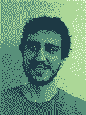

# About me

  
  <ul>
    <li><a href="/docs/resume.pdf"></a></li>
    <li><a href="http://lattes.cnpq.br/5029099102514492"></a></li>
    <li><a href="https://www.researchgate.net/profile/Fabio-C-C-Meneghetti"></a></li>
    <li><a href="https://scholar.google.com/citations?user=htGuJdwAAAAJ"></a></li>
    <li><a href="https://orcid.org/0000-0001-8323-1282"></a></li>
    <li><a href="https://github.com/fabiom"></a></li>
  </ul>
  Email: <code>contact@fabiom.net</code> 
  Telegram: <code><a href="https://t.me/fabiom">@fabiom</a></code>

Hey there! I am a PhD student at the University of Campinas ([IMECC](https://www.ime.unicamp.br/)/[Unicamp](https://www.unicamp.br/)), advised by Prof. Sueli I. R. Costa.

## Interests

My areas of main interest are at the intersection of geometry and information theory, such as, but not limited to:

- [Information geometry](/information-geometry) and statistical manifolds
- Measures of information and divergence
- Lattices and applications to information sciences

Following [MSC2020](https://mathscinet.ams.org/mathscinet/msc/msc2020.html), these are roughly {`94A17`, `53B12`, `94A15`}.

## Publications

- (2022) F. C. C. Meneghetti, H. K. Miyamoto, S. I. R. Costa — *[Information Properties of a Random Variable Decomposition through Lattices](https://www.mdpi.com/2673-9984/5/1/19)*, (Proceeding Paper, Presented at the 41st International Workshop on Bayesian Inference and Maximum Entropy Methods in Science and Engineering --- MaxEnt2022)
- (2022) H. K. Miyamoto, F. C. C. Meneghetti, S. I. R. Costa — *[The Fisher-Rao Loss for Learning under Label Noise](https://doi.org/10.1007/s41884-022-00076-8)* (Information Geometry --- Springer)
- (2020) *[Reticulados: um estudo de alguns parâmetros relevantes para aplicações em criptografia](docs/dissertacao.pdf)* (Master's Dissertation)

### Other texts

- (2021) [An introduction to code-based cryptography](docs/code-based-cripto.pdf)

## Presentations

- (2022) [Conexões duais](docs/conexoes-duais-2022.pdf)
- (2022) [Enrolamento e quantização de distribuições de probabilidade por reticulados](docs/enrolamento-quantizacao-2022.pdf)
- (2022) [Geometria da informação e algumas de suas aplicações](docs/geoinfo-ufsc-2022.pdf) — Samati @UFSC
- (2022) [Parâmetros de reticulados e criptografia](docs/crypto-lattice-2022.pdf)
- (2022) [Métodos geométricos aplicados a ciências da informação](docs/quali-doutorado.pdf)
- (2021) [Uma Introdução a Geometria da Informação](docs/info-geometry2021.pdf)
- (2020) [Reticulados: um estudo de parâmetros relevantes para aplicações em criptografia](docs/defesa-mestrado.pdf)
- (2019) [Usando GAP para trabalhar com códigos](docs/gap-2019.pdf)
- (2019) [Reticulados e Aplicações em Criptografia](docs/cnmac-2019-poster.pdf) — Poster, CNMAC @UFU
- (2016) [Curso de LaTeX](/curso-LaTeX-camecc)
- (2016) [Uma Introdução à Teoria de Códigos](docs/divulgamat2016.pdf)
